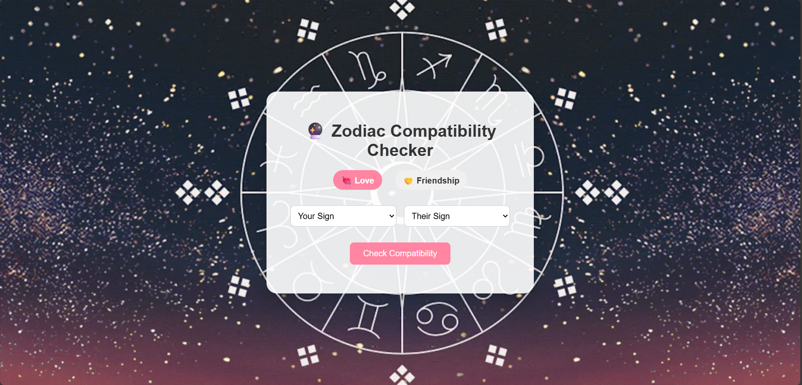
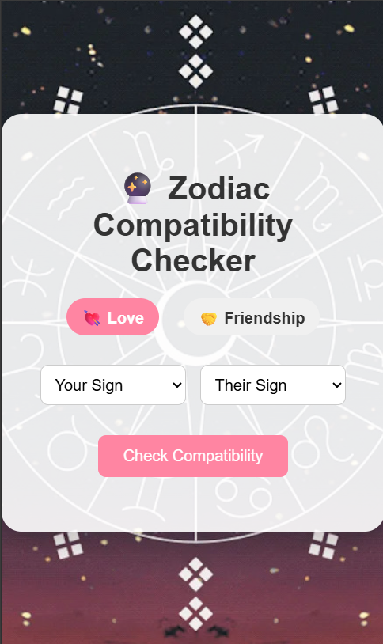

# 🔮 Zodiac Compatibility Checker

A simple and fun web-based static project to check zodiac sign compatibility in **Love** and **Friendship**. Built using **HTML**, **CSS**, and **JavaScript**.

A fun, client-side project that lets users check zodiac sign compatibility in love or friendship.  
Compatibility is calculated randomly using `Math.random()` to keep results light and entertaining.

## 🌐 Live Demo

[Check it out here]([https://SakshiKumari271github.io/zodiac-compatibility-checker/](https://sakshikumari271.github.io/zodiac-compatibility-checker/))


## ✨ Features

- 🔘 Toggle between **Love** and **Friendship** compatibility modes  
- 🔍 Select zodiac signs from both sides  
- 📊 Check compatibility instantly  
- 🎨 Beautiful and minimal user interface  
- 💡 Fully client-side (no backend needed)
- Fully Responsive

## Preview
 
 

## 🚀 Getting Started

### 1. Clone the Repository

```bash
git clone https://github.com/SakshiKumari271/zodiac-compatibility-checker.git
cd zodiac-compatibility-checker
```

### 2. Open `index.html`

You can simply open `index.html` in any web browser.

## 📁 Project Structure

```
.
├── index.html        # Main HTML file
├── style.css         # Styling (CSS)
├── script.js         # Logic for compatibility check
└── README.md         # Project documentation
```

## 📌 Technologies Used

- HTML5  
- CSS3  
- JavaScript (Vanilla JS)

## 🙏 Disclaimer
- ⚠️ Compatibility results are randomly generated using JavaScript's `Math.random()`. This is for entertainment purposes only and not based on astrology.
- This app is built purely for fun and educational purposes. It does not reflect real astrological compatibility.


## 🙋‍♀️ Created By

**Sakshi Kumari**  
**[Sakshi Kumari](https://github.com/sakshikumari271)**  
🪐 Passionate about astrology and web development

## 📃 License

This project is open source and free to use under the [MIT License](LICENSE).

## 💡 Contribute

Want to add more zodiac logic, UI effects, or features?  
Feel free to fork the project, suggest improvements, or open a PR!
